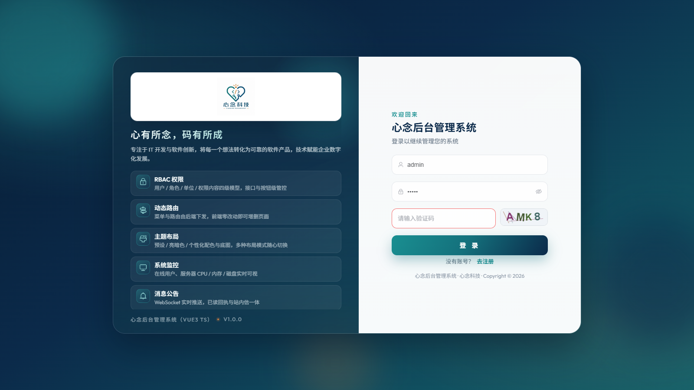
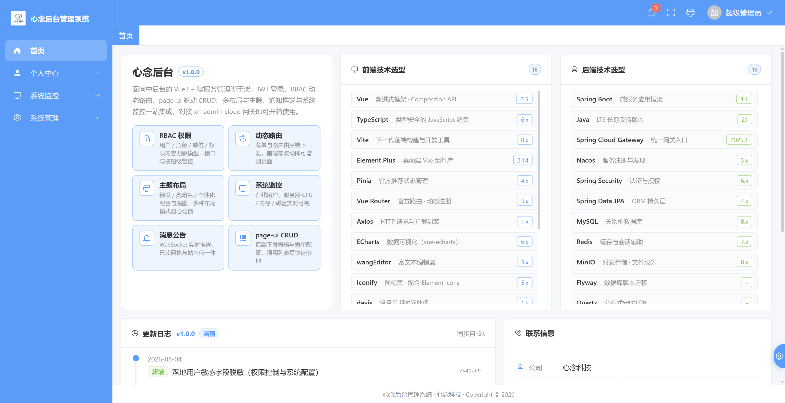

# xn-admin-vue3-js

[English](README.en.md) | [简体中文](README.md)

XinNian Admin frontend: Vue 3 + **JavaScript** + Vite + Element Plus (Composition API / `<script setup>`).

Feature-aligned with the baseline repo **xn-admin-vue3-ts**, sharing backend **xn-admin-cloud**. Choose this if you want Composition API without TypeScript. Apache License 2.0 — **free for personal and commercial use**.

[](./LICENSE)
[](./LICENSE)
[](./LICENSE)
[](./LICENSE)

Version: `1.0.0` · License: [Apache-2.0](./LICENSE) · Copyright 2026 XinNian

**Live demo:** https://vue3-js.xinniankeji.vip · Website: https://xinniankeji.vip

## Related repositories

| Repository | Gitee | GitHub | Notes |
|------|-------|--------|------|
| `xn-admin-cloud` | [Gitee](https://gitee.com/jenning/xn-admin-cloud) | [GitHub](https://github.com/xinnian0310/xn-admin-cloud) | Backend (required) |
| `xn-admin-vue3-ts` | [Gitee](https://gitee.com/jenning/xn-admin-vue3-ts) | [GitHub](https://github.com/xinnian0310/xn-admin-vue3-ts) | Feature baseline (TypeScript) |
| `xn-admin-vue3-js` | [Gitee](https://gitee.com/jenning/xn-admin-vue3-js) | [GitHub](https://github.com/xinnian0310/xn-admin-vue3-js) | This repo |
| `xn-admin-vue2-js` | [Gitee](https://gitee.com/jenning/xn-admin-vue2-js) | [GitHub](https://github.com/xinnian0310/xn-admin-vue2-js) | Vue 3 + JavaScript (Options API) |
| `xn-admin-react-ts` | [Gitee](https://gitee.com/jenning/xn-admin-react-ts) | [GitHub](https://github.com/xinnian0310/xn-admin-react-ts) | React + TypeScript |

## Prerequisites

1. Node.js 20+ (see `.nvmrc`)
2. Backend **xn-admin-cloud** running, gateway at http://127.0.0.1:8088
3. MySQL / Redis / Nacos / MinIO ready

## Default accounts

| Username | Initial password | Notes |
|----------|------------------|------|
| `SuperAdmin` | `SuperAdmin` | Super admin |
| `admin` | `admin` | Admin |

Local development only. Change passwords after login. See [SECURITY.md](./SECURITY.md).

## Quick start

```bash
npm install
npm run dev
```

Dev URL: http://localhost:1802

Vite proxies `/api`, `/uploads`, `/ws`, `/swagger-ui`, `/v3/api-docs` to `http://localhost:8088`.

```bash
npm run build
npm run preview
npm run lint
npm run test
npm run ci            # lint + format:check + test + build
```

No `vue-tsc` / `typecheck` in this repo.

## Differences from the baseline

- Language: TypeScript → JavaScript
- `APP_CLIENT_ID`: `xn-admin-vue3-js` (`src/config/client.js`)
- Dev port: `1802`
- Same backend contract and UI capabilities

## Stack

Vue 3.5, JavaScript, Vite 8, Element Plus, Pinia 4, Vue Router 5, Axios, ECharts, wangEditor, ExcelJS, ESLint, Prettier, Vitest, Husky.

## Screenshots

Same module filenames as the baseline, in [`docs/images/`](./docs/images/).

| Page | Screenshot |
|------|------------|
| Login |  |
| Dashboard |  |
| Users |  |
| Roles |  |
| Files |  |
| Jobs |  |

More screenshots (profile, monitor, logs, units, permissions, notices, settings, recycle, codegen, API docs) use the same names under `docs/images/`.

## Production (summary)

- `npm run build`, then Nginx
- Reverse-proxy `/api`, `/uploads`, `/ws` to gateway `127.0.0.1:8088`
- [SECURITY.md](./SECURITY.md) · [CONTRIBUTING.md](./CONTRIBUTING.md)

## Support

If this project helps you, a coffee is welcome ☕

<p align="center">
  
</p>

## License

[Apache License 2.0](./LICENSE). Personal and commercial use allowed. Keep copyright, license, and NOTICE; mark modified files. Donations are not a commercial license or paid support.
